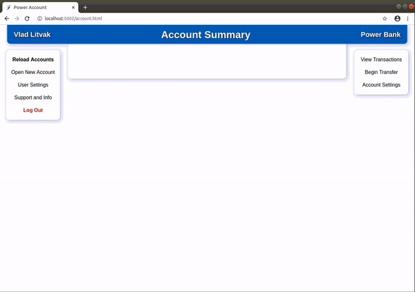

# Banking Database & API Processing

### [See Demos](#login--change-user-info)

### DESCRIPTION

- This program sets up a banking database in MySQL with live java code running on a server, processing API requests as they come in.
- The API provides enough functionality for a front end program to be fully serviced without any need to directly access the database.
 

### FILE INFO

- [**CreateDatabase.sql**](CreateDatabase.sql) initializes a MySQL database to be used by a banking system. The database includes:
  - a `Customers` table
  - an `Accounts` table
  - a `Transactions` table
  - a trigger which automatically services transaction requests
  - two intermediate API request tables: one for API calls, and the other for responses
    - these are separate tables to mitigate concurrent reads and writes

- [**APIProcessing.java**](APIProcessing.java) is constantly listening to any updates to the intermediate request table. When updated, the input JSON is received, parsed, and its request is fulfilled. Then, an output JSON is constructed and put into a matching row in the response table, ready to be returned to the front end. 
 

### API FUNCTIONALITY
  
- The API has the functionality to: 
  - register users
  - login users
  - change a user's name, address, or password
  - open or close a bank account
  - change a bank account's name
  - withdraw, deposit, or transfer money
  - get a user's info (name, address)
  - get a user's or a single account's transaction history

- For more information on the API, including the format of input and output JSONs, see [**Bank API Documentation.pdf**](Bank%20API%20Documentation.pdf)
 

### PROGRAM SETUP

- Run [**CreateDatabase.sql**](CreateDatabase.sql) in your MySQL database.
- Edit the global database variables (address, username, password) in [**APIProcessing.java**](APIProcessing.java) (lines 25-27). Then, download the MySQL JDBC .jar file, along with the JSON .jar file.
- Run [**APIProcessing.java**](APIProcessing.java) with the two .jar files in the class path, e.g:
  > `$ java -cp mysql-connector-java-8.0.19.jar:json-simple-1.1.1.jar APIProcessing.java`
 
 

   
  <h2>Login & Change User Info</h2>
  
   
   
  <h2>Open Bank Account</h2>
  
   
   
  <h2>Transfer Money & View Transaction History</h2>
  
   
   
  <h2>Rename & Close Bank Account</h2>
  
   
   
  <h2>API Listener</h2>
  

